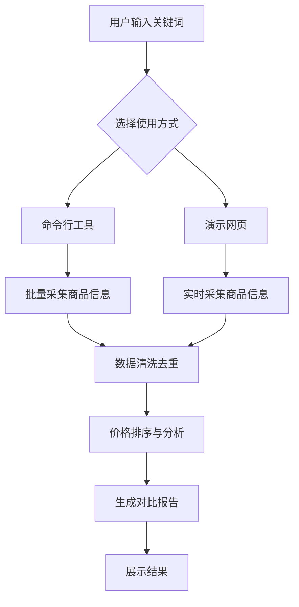

## 1. Product Overview
电商商品价格自动化采集与对比工具，用于从主流电商平台批量抓取商品信息并进行价格对比分析。
- 解决用户在多个电商平台比价的繁琐问题，帮助用户快速找到性价比最高的商品
- 目标用户为价格敏感型消费者、电商比价分析师及小型电商商家

## 2. Core Features

### 2.1 User Roles (if applicable)
| Role | Registration Method | Core Permissions |
|------|---------------------|------------------|
| Normal User | 无需注册 | 使用所有功能 |

### 2.2 Feature Module
1. **命令行工具**: 支持批量抓取、数据清洗、排序与分析
2. **演示网页**: 提供可视化界面，支持关键词搜索和结果展示
3. **数据可视化**: 生成价格趋势图表和性价比分析

### 2.3 Page Details
| Page Name | Module Name | Feature description |
|-----------|-------------|---------------------|
| 演示网页 | 搜索框 | 输入关键词，触发商品采集 |
| 演示网页 | 结果展示区 | 展示采集到的商品信息，包括名称、价格、销量、店铺评分、链接 |
| 演示网页 | 排序功能 | 支持按价格、销量、评分等维度排序 |
| 演示网页 | 对比分析 | 展示商品横向对比和价格趋势图表 |
| 演示网页 | 性价比推荐 | 自动标注性价比高的商品 |
| 命令行工具 | 批量采集 | 从京东、淘宝、拼多多批量抓取商品信息 |
| 命令行工具 | 数据处理 | 清洗去重数据，按价格排序 |
| 命令行工具 | 分析报告 | 生成价格对比分析和推荐结果 |

## 3. Core Process
用户可以通过两种方式使用该工具：
1. **命令行方式**：运行脚本，指定关键词和平台，获取分析结果
2. **网页方式**：在网页输入关键词，点击搜索，查看实时采集和分析结果

## 4. User Interface Design
### 4.1 Design Style
- 主色调：#3498db（蓝色）、#2ecc71（绿色）
- 按钮风格：圆角按钮，悬停效果
- 字体：无衬线字体，主标题18px，正文14px
- 布局风格：卡片式布局，清晰的信息层次
- 图标风格：线性图标，简洁明了

### 4.2 Page Design Overview
| Page Name | Module Name | UI Elements |
|-----------|-------------|-------------|
| 演示网页 | 搜索框 | 居中大搜索框，蓝色主题，带有搜索图标 |
| 演示网页 | 结果展示区 | 卡片式布局，每个卡片包含商品图片、名称、价格、销量、评分、链接 |
| 演示网页 | 排序功能 | 下拉菜单，支持多维度排序 |
| 演示网页 | 对比分析 | 折线图展示价格趋势，雷达图展示商品综合评分 |
| 演示网页 | 性价比推荐 | 绿色标签标注高性价比商品 |

### 4.3 Responsiveness
- 桌面优先设计，支持响应式布局
- 移动端适配，调整为单列布局
- 触控优化，按钮和可点击区域足够大

### 4.4 3D Scene Guidance (if applicable)
- 无3D场景需求