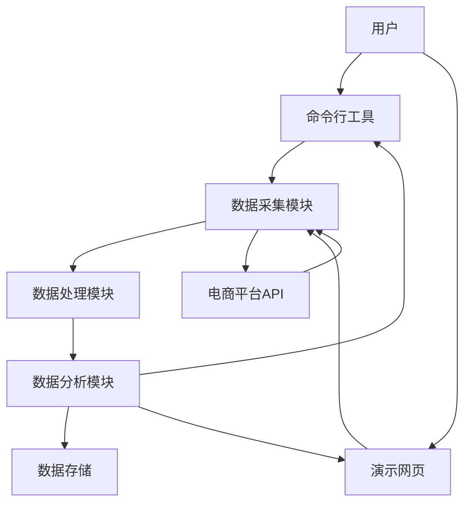
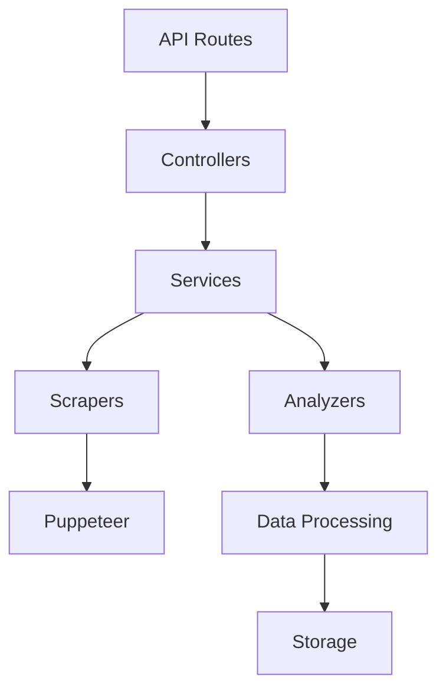
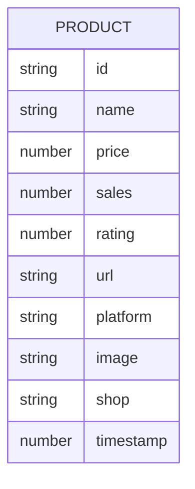

## 1. Architecture Design


## 2. Technology Description
- Frontend: React@18 + Tailwind CSS@3 + Vite + ECharts
- Initialization Tool: vite-init
- Backend: Express@4 (用于处理网页请求和数据采集)
- Database: 本地文件存储 (JSON格式)
- 数据采集: Puppeteer (用于模拟浏览器抓取数据)
- 数据可视化: ECharts

## 3. Route Definitions
| Route | Purpose |
|-------|---------|
| / | 演示网页主页 |
| /api/scrape | 商品采集API |
| /api/analyze | 数据分析API |

## 4. API Definitions
### 4.1 商品采集API
**请求**: POST /api/scrape
```typescript
interface ScrapeRequest {
  keyword: string;  // 搜索关键词
  platforms: string[];  // 电商平台列表 ['jd', 'taobao', 'pdd']
  limit: number;  // 每个平台采集的商品数量
}
```

**响应**: 
```typescript
interface ScrapeResponse {
  success: boolean;
  data: Product[];
  error?: string;
}

interface Product {
  id: string;
  name: string;
  price: number;
  sales: number;
  rating: number;
  url: string;
  platform: string;
  image: string;
  shop: string;
  timestamp: number;
}
```

### 4.2 数据分析API
**请求**: POST /api/analyze
```typescript
interface AnalyzeRequest {
  products: Product[];
  sortBy: string;  // 排序字段: 'price', 'sales', 'rating'
  sortOrder: string;  // 排序方式: 'asc', 'desc'
}
```

**响应**: 
```typescript
interface AnalyzeResponse {
  success: boolean;
  data: {
    sortedProducts: Product[];
    priceTrend: PriceTrend[];
    recommendations: Product[];
  };
  error?: string;
}

interface PriceTrend {
  platform: string;
  averagePrice: number;
  minPrice: number;
  maxPrice: number;
}
```

## 5. Server Architecture Diagram


## 6. Data Model
### 6.1 Data Model Definition


### 6.2 Data Definition Language
由于使用本地文件存储，不需要数据库DDL语句。数据将以JSON格式存储在本地文件中。

## 7. 核心实现逻辑
### 7.1 数据采集逻辑
1. 使用Puppeteer模拟浏览器访问电商平台
2. 输入关键词进行搜索
3. 解析搜索结果页面，提取商品信息
4. 处理分页，获取更多商品数据
5. 对采集的数据进行初步清洗

### 7.2 数据处理逻辑
1. 去重：根据商品ID或链接去重
2. 数据清洗：处理价格、销量等数据格式
3. 数据标准化：统一不同平台的数据格式

### 7.3 数据分析逻辑
1. 按价格排序：从低到高
2. 计算性价比：基于价格、销量、评分的综合计算
3. 生成价格趋势图表数据
4. 标注高性价比商品

### 7.4 命令行工具实现
1. 解析命令行参数：关键词、平台、数量等
2. 调用数据采集模块
3. 执行数据处理和分析
4. 输出分析结果到控制台或文件

### 7.5 网页实现
1. 搜索界面：输入关键词，选择平台
2. 结果展示：卡片式布局，展示商品信息
3. 排序功能：按不同维度排序
4. 数据可视化：展示价格趋势和对比图表
5. 性价比推荐：标注推荐商品